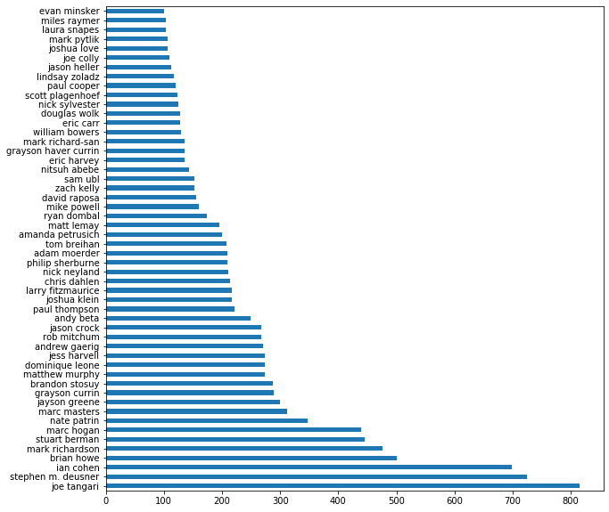
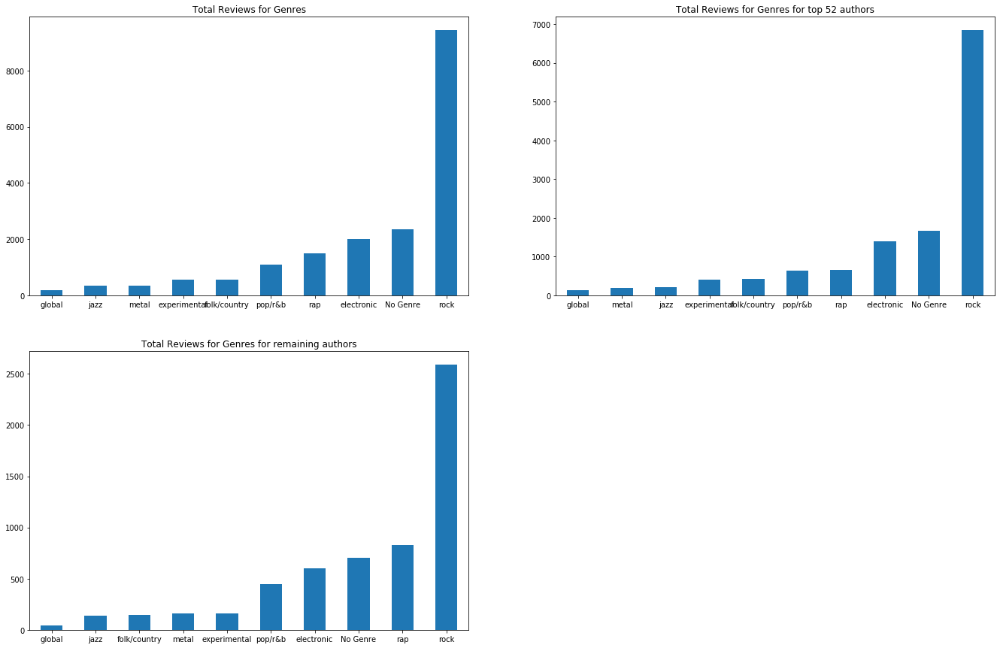
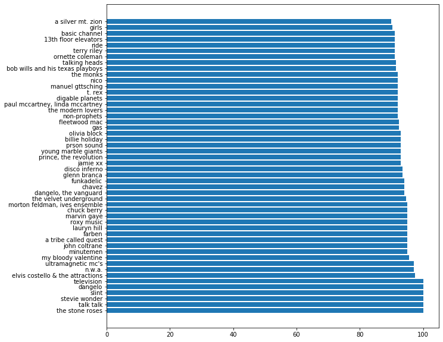

# Pitchfork-Reviews-Analysis

### Things to do:
1. Word Clouds
2. Top reviewers scores for albums
3. Top reviewers scores by genre & differences

Representations of how many authors have garnered more than 100 reviews for Pitchfork up to 2017

Distribution of reviews for genres for the total data, top 52, and remaining authors

The best new music scores and amount over the years at Pitchfork

Top 20 music labels with at least 10 album reviews

Average score differences between the genres

Top 50 artists reviewed by average score

Bottom 50 artists reviewed by average score

** Work in progress **
